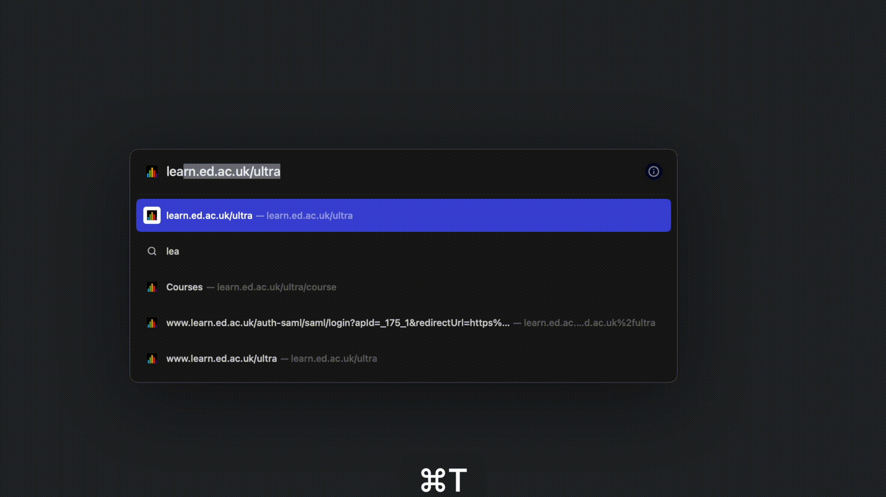

# MyEd_fast_login
This script is automates the login process for University of Edinburgh's EASE portal, so no need to click Buttons anymore and actually SAVE YOUR TIME when uploading coursework (we all know it's probabaly right before ddl :(



## Disclaimer

IMPORTANT NOTE: This userscript stores your account username and password directly in the script. This is generally considered bad practice, as it can be a security risk. We strongly recommend that you use a password manager instead of storing your passwords in userscripts or other files. By using this userscript, you assume all risks associated with storing your password in this way.

## Installation

To use this userscript, you will need to have the Tampermonkey extension installed in your web browser. Tampermonkey is available for Chrome, Firefox, Safari, and other popular browsers.

1. Install the Tampermonkey extension in your browser. (See the [Tampermonkey website](https://www.tampermonkey.net/) for more information.)
2. Open the Tampermonkey dashboard by clicking the Tampermonkey icon in your browser toolbar and selecting "Dashboard."
3. Click the "Utilities" tab, and then select "Install from URL."
4. Paste the following URL into the "URL" field: `https://github.com/Anson-git/MyEd_fast_login/raw/main/School_Portal_Fast_Login.user.js`
5. Click the "Install" button.
6. See the "Usage" section below for instructions on how to configure(dead-simple) the script.

*Please check the script before using it. If step4's url is not available, you can always download the script and install it manually.*

## Usage

Once the userscript is installed, you NEED to replace username and password with your own. To do this, open the Tampermonkey dashboard and select "School Portal Fast Login" from the list of installed userscripts. Click the "Edit" button, and then replace the username and password fields with your own. Click the "Save" button to save your changes.

Then, simply navigate to your school's portal login page(e.g. learn.ed.ac.uk) and the script will automatically fill in your username and password and log you in to your account.


## License

This userscript is released under the GNU General Public License v3.0. You are free to modify and distribute this script without profit, as long as you provide attribution to the original author.```

